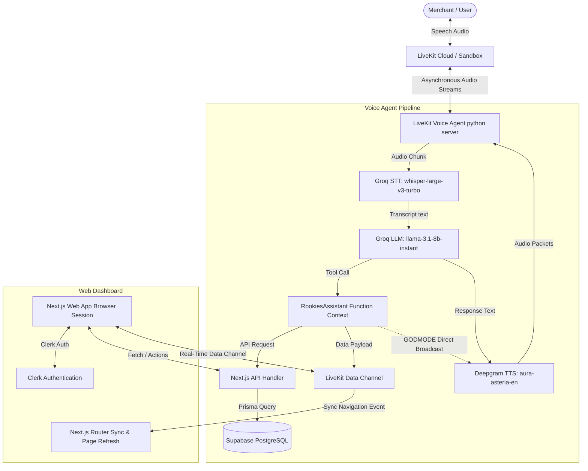

# 🍊 ROOKIES - Project Overview & Technical Architecture Documentation

Rookies is an all-in-one business management platform and **Virtual COO** designed for small businesses (home bakers, kirana stores, Instagram brands, etc.) to manage inventory, track orders, and engage customers seamlessly using a warm, responsive Next.js 16.1 dashboard and an **intelligent, real-time AI Voice Agent**.

---

## 🏗️ System & Network Architecture

The Rookies ecosystem bridges a **Next.js Web Application** and a **Python-based LiveKit Voice Agent Server** using real-time bidirectional data networks.



---

## 🛠️ Deep Dive: Core Engineering Innovations

### 1. High-Performance "Godmode" TTS Streaming
- **The Problem**: Reading out an entire inventory list (e.g., 10+ items with names, quantities, and prices) through the LLM causes massive response latency (time-to-first-byte) and consumes high token budgets.
- **The Solution**: 
  - We implemented a **60-second in-memory cache** (`self._inventory_cache` and `self._inventory_cache_ts`) inside `RookiesAssistant`.
  - When the user asks for the inventory, the system retrieves it, formats it into natural speech, and directly feeds it to Deepgram's TTS engine via `asyncio.ensure_future(self.assistant.say(menu_text, ...))` bypassing the LLM step entirely.
  - This reduces reading latency from **~3.5 seconds** down to **less than 200ms**.

### 2. Bidirectional Client Navigation & Data Hydration
- **Voice-Driven Navigation**: When an action completes (e.g., `add_inventory` or `create_order`), the Voice Agent publishes a binary navigation payload over the LiveKit RTC channel:
  ```python
  payload = json.dumps({"type": "navigation", "path": "/dashboard/inventory"}).encode('utf-8')
  await self.ctx.room.local_participant.publish_data(payload)
  ```
- **Front-End Listening & Force-Refresh**:
  - The client-side dashboard component (`components/VoiceAgent.tsx`) receives the packet.
  - It triggers browser navigation using `router.push(data.path)`.
  - It calls `router.refresh()` to force React Server Components (RSC) to re-evaluate data-fetching functions. This ensures newly added items appear on the dashboard instantly without manual reloading.

### 3. Smart Conversational State Machine for Inventory
- **Tool Definition (`add_inventory`)**: Designed as an atomic, conversational onboarding tool.
- **Field Gathering Pipeline**: The assistant uses specialized prompt rules to collect fields one-by-one:
  1. Product Name (Required)
  2. SKU (Optional, user can say "skip")
  3. Stock Quantity (Required)
  4. Unit (Required, e.g., "kg", "pcs", "liters")
  5. Cost Price (Optional, user can say "skip")
  6. Sell Price (Required)
  7. Low Stock alert levels (Optional, user can say "skip")
- **Duplicate Protection Safeguard**: Before calling the backend DB client, the tool runs a duplicate name check against existing inventory items to prevent duplicate records, gracefully warning the merchant if the product already exists.

### 4. Dynamic Context Trim Optimizer (`trim_context`)
- **Vocal Latency Mitigation**: To prevent chat contexts from swelling during long voice calls—which increases LLM processing times and triggers Groq TPM (Tokens Per Minute) limits—we built an asynchronous callback interceptor:
  ```python
  def trim_context(assistant: VoiceAssistant):
      ctx    = assistant.chat_ctx
      msgs   = ctx.messages
      system = [m for m in msgs if m.role == "system"]
      convo  = [m for m in msgs if m.role != "system"]
      if len(convo) > 6:
          ctx.messages = system + convo[-6:]
  ```
- This prunes historical speech turns on every final transcript while preserving the core system directives, maintaining a highly responsive loop.

---

## 🗄️ Database Architecture (Supabase PostgreSQL)

Rookies utilizes a multi-tenant database layout mapped via Prisma. Row Level Security (RLS) is fully active, restricting merchants to only view and edit records matching their business identifiers.

```
                  ┌──────────────────────┐
                  │       Business       │
                  └──────────┬───────────┘
                             │ 1
                             ├───────────────────────────────┐
                             │ 1..*                          │ 1..*
                  ┌──────────▼───────────┐        ┌──────────▼───────────┐
                  │    BusinessMember    │        │    InventoryItem     │
                  └──────────────────────┘        │ (sku, costPrice, etc)│
                                                  └──────────────────────┘
                             │ 1..*                          │ 1
                             │                               │
                  ┌──────────▼───────────┐                   │
                  │        Order         │◄──────────────────┘
                  │   (Json items)       │
                  └──────────▲───────────┘
                             │ 1..*
                             │
                  ┌──────────┴───────────┐
                  │       Customer       │
                  └──────────────────────┘
```

---

## 🔄 Project Workflows & Operations

### 🎙️ The Voice-Driven Inventory Creation Flow
1. **Trigger**: Merchant clicks the Voice Agent mic and says *"I want to add a new product to my inventory"*.
2. **Name Collection**: Agent asks *"What is the name of the product?"*. Merchant replies *"Chocolate Chip Cookies"*.
3. **SKU Collection**: Agent asks *"What is the SKU code? You can say skip"*. Merchant replies *"Cookies 101"* (or *"skip"*).
4. **Quantity Collection**: Agent asks *"How many units do you have in stock?"*. Merchant replies *"50"*.
5. **Unit Collection**: Agent asks *"What is the unit type?"*. Merchant replies *"packets"*.
6. **Cost Price Collection**: Agent asks *"What is the cost price per packet? You can say skip"*. Merchant replies *"Rs 80"*.
7. **Selling Price Collection**: Agent asks *"What is the selling price per packet?"*. Merchant replies *"Rs 120"*.
8. **Alert Level Collection**: Agent asks *"At what stock quantity should I alert you? You can say skip"*. Merchant replies *"10"*.
9. **Creation & Verification**: 
   - Agent runs a duplicate check to verify no other item named *"Chocolate Chip Cookies"* exists.
   - If clear, the agent invokes `add_inventory` tool context, creating the item in the database.
   - The agent publishes a navigation command to `/dashboard/inventory`.
   - The web app navigates and executes a server-side refresh, showing the cookie item immediately.
   - The agent confirms: *"Added Chocolate Chip Cookies to inventory at Rs 120 with 50 packets in stock."*
